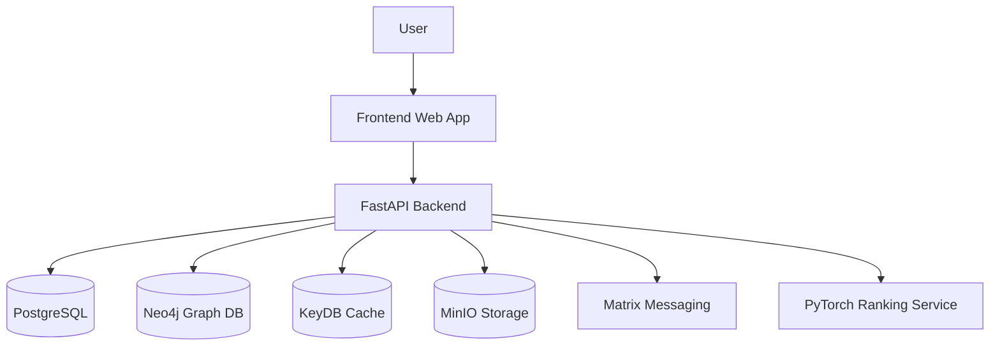

# Architecture Overview

OpenConnect is structured around a modular, wellness-first platform architecture that separates user experience, core application services, and supporting infrastructure.

## High-Level Flow

## Component Responsibilities

- Frontend: delivers the main web experience and surfaces feed, social graph, and messaging functionality.
- Backend API: coordinates authentication, content operations, feed generation, and service integrations.
- PostgreSQL: stores structured application data such as users, posts, and permissions.
- Neo4j: models social connections and graph-based relationships.
- KeyDB: provides caching for hot reads and transient state.
- MinIO: stores media assets in an S3-compatible object store.
- Matrix: enables decentralized, end-to-end encrypted messaging.
- PyTorch Ranking Service: scores and prioritizes content using a wellness-focused ranking model.

## Development Notes

- Keep the backend and data services loosely coupled so they can evolve independently.
- Favor explicit interfaces between services to preserve auditability and transparency.
- Ensure ranking and moderation logic remains explainable and aligned with the project’s wellness-first mission.
